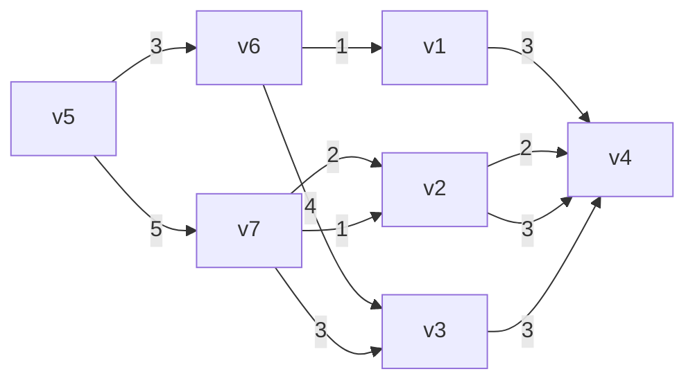

## vertex:7	edge:11	start:v5	end:v4

```mermaid
graph LR;
    v1--3-->v4
    v2--2-->v4
    v2--3-->v4
    v3--3-->v4
    v5--5-->v7
    v5--3-->v6
    v6--1-->v1
    v6--4-->v3
    v7--2-->v2
    v7--3-->v3
    v7--1-->v2
```
|vertex|indegree|
|:---:|:--:|
|v1|1|
|v2|2|
|v3|2|
|v4|4|
|v5|0|
|v6|1|
|v7|1|
