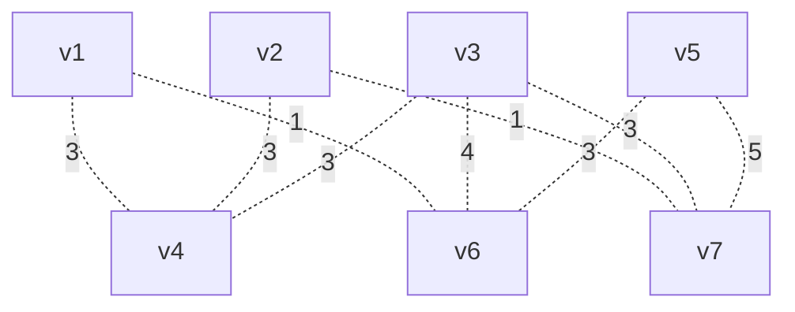

## vertex:7	edge:11	start:v5	end:v4

### No.1

now visit: v5

| v1 | v2 | v3 | v4 | v5 | v6 | v7 |
| :-: | :-: | :-: | :-: | :-: | :-: | :-: |
| ∞ | ∞ | ∞ | ∞ | 0 | 3 | 5 |

min: v5 = 3

### No.2

now visit: v6

| v1 | v2 | v3 | v4 | v5 | v6 | v7 |
| :-: | :-: | :-: | :-: | :-: | :-: | :-: |
| 4 | ∞ | 7 | ∞ | 0 | 3 | 5 |

min: v0 = 4

### No.3

now visit: v1

| v1 | v2 | v3 | v4 | v5 | v6 | v7 |
| :-: | :-: | :-: | :-: | :-: | :-: | :-: |
| 4 | ∞ | 7 | 7 | 0 | 3 | 5 |

min: v6 = 5

### No.4

now visit: v7

| v1 | v2 | v3 | v4 | v5 | v6 | v7 |
| :-: | :-: | :-: | :-: | :-: | :-: | :-: |
| 4 | 6 | 7 | 7 | 0 | 3 | 5 |

min: v1 = 6

### No.5

now visit: v2

| v1 | v2 | v3 | v4 | v5 | v6 | v7 |
| :-: | :-: | :-: | :-: | :-: | :-: | :-: |
| 4 | 6 | 7 | 7 | 0 | 3 | 5 |

min: v3 = 7

### No.6

now visit: v4

| v1 | v2 | v3 | v4 | v5 | v6 | v7 |
| :-: | :-: | :-: | :-: | :-: | :-: | :-: |
| 4 | 6 | 7 | 7 | 0 | 3 | 5 |

min: v2 = 7

### No.7

now visit: v3

| v1 | v2 | v3 | v4 | v5 | v6 | v7 |
| :-: | :-: | :-: | :-: | :-: | :-: | :-: |
| 4 | 6 | 7 | 7 | 0 | 3 | 5 |

min: v2 = 7
